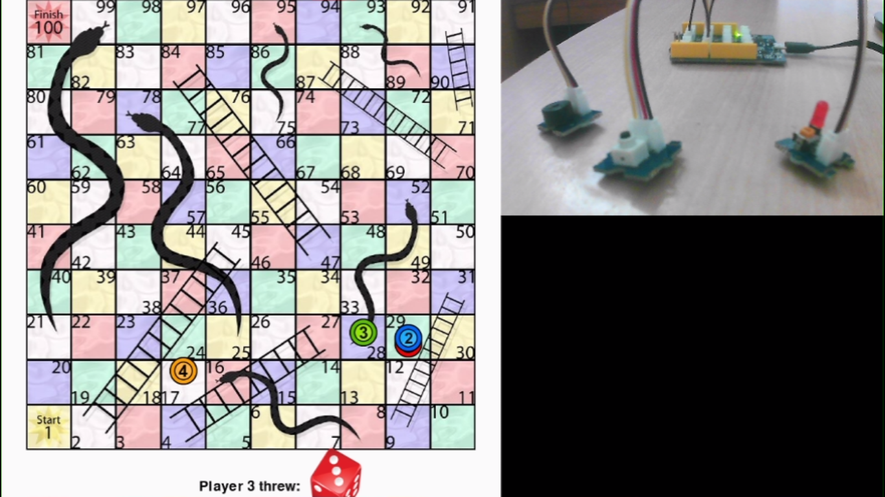

# SnakesNLadders

 

 

~~~
$ git clone https://github.com/UltimateRoman/HackersNLadders
$ cd HackersNLadders/game
$ pip install -r requirements.txt
$ python main.py
~~~

What it does-
Our project takes the idea of snake and ladders board game and tries to make a aesthetic design of the game on a computer

When the user presses the button connected to arduino, it simulates a dice roll and generates a value in the range 1 to 6. The value is then sent over to the Python GUI using the Pyserial module. And the move played by the user get’s updated in the GUI. If the user’s token lands on the snake or ladder, we send another signal to the Arduino which is then connected to the LEDs. 

How we built it-

1.We used python for the graphics and the user interface and the working part of the dice and the tokens.
2. We also used arduino ,which acts as a controller in the game. LED indicators of arduino are used to show if the tokens land on a ladder or a snake, which makes the user attentive towards the game.

Challenges we ran into-

1.This was the first hackathon for most of the members involved in the project. 
2.We did not know  much of GUI programming prior to this. Although, we did end up doing significant implementations of python GUI in the project. 
3.Another challenge was to connect arduino to the GUI implementation. 
We also wanted to show animated transitions in the project, but due to lack of time and distance among the members we were unable to do much about it. Although we tried our best.

Accomplishments that we are proud of-
We were able to connect Arduino with the python game using pyserial library.
Python GUI implementation using the pygame module.
Submitting a project as a beginner at a hackathon hosted by Major League Hacking.

What we learnt-

We hope to expand the idea of the game. 
1. Make it online, use Web Sockets so players around the world can play with anyone online.
2. Maintain a leader board and a rating system having a centralised database to score points.
3. Improve upon the UI of the game's GUI.

What’s Next-

We hope to expand the idea of the game in the following ways-
1. Make it online, use Web Sockets so players around the world can play with anyone online.
2. Maintain a leader board and a rating system having a centralised database to store points.
3. Improve upon the UI of the game's GUI.

Enjoy the game!

